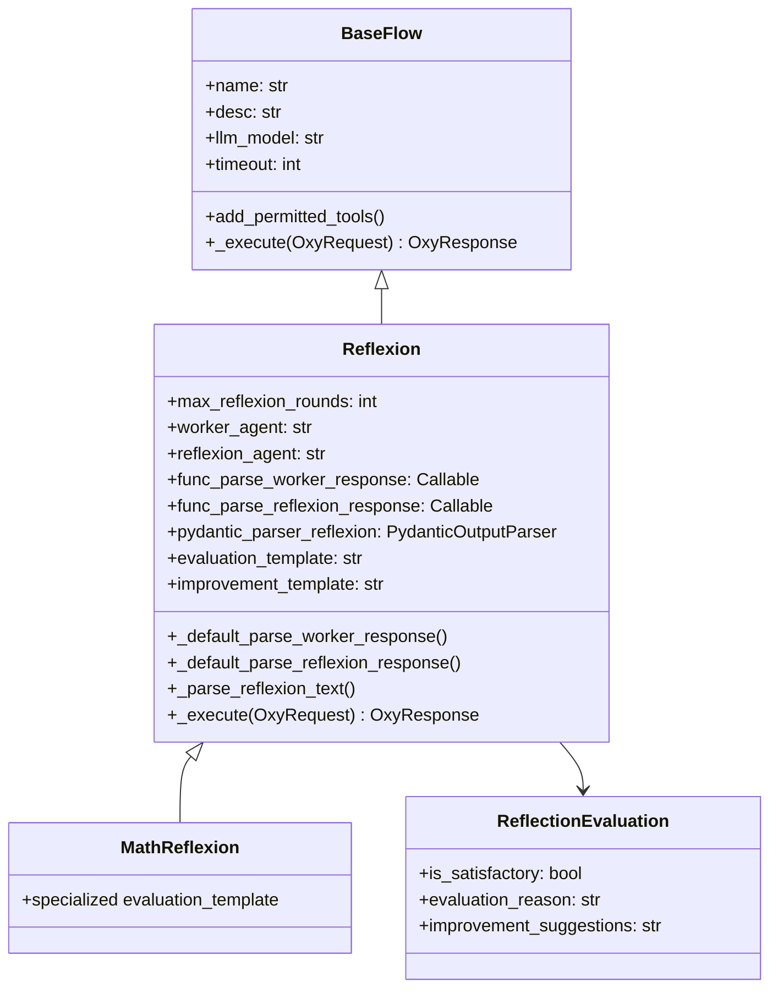
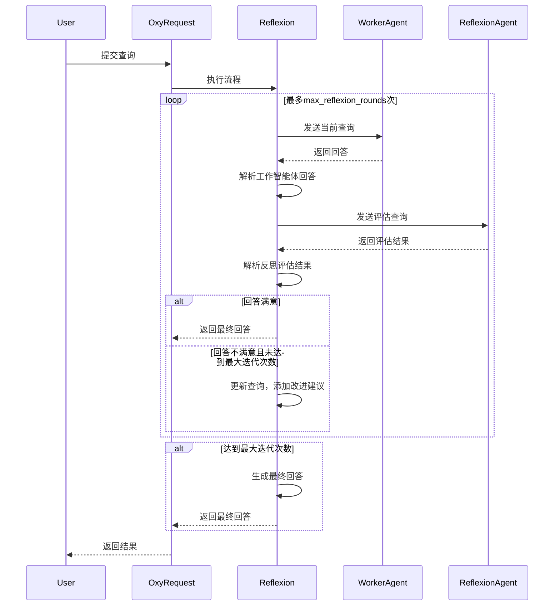

# Reflexion
```
[Oxy](./base_oxy.md)
├── [BaseFlow](./base_flow.md)
    ├── [BaseAgent](./base_agent.md)
    │   ├── [LocalAgent](./local_agent.md)
    │   │       ├── [ParallelAgent](./parallel_agent.md)
    │   │       ├── [ReActAgent](./react_agent.md)
    │   │       ├── [ChatAgent](./chat_agent.md)
    │   │       └── [WorkflowAgent](./workflow_agent.md)
    │   └── [RemoteAgent](./remote_agent.md)
    │           └── [SSEOxyGent](./sse_oxy_agent.md)
    └──[Reflexion](.reflexion.md)
└── [BaseTool](../tools/base_tools.md)
```

## 概述
`Reflexion`流程通过反思机制，通过智能体识别回答中的不足并持续改进，使智能体能够自我评估并迭代优化输出，适用于需要高精度输出的场景。与此同时，多轮反思生成更高质量的回答会导致执行时间更长。


## 架构



## 参数说明

### Reflexion类参数

| 参数名 | 类型 | 默认值 | 说明 |
|-------|------|-------|------|
| max_reflexion_rounds | int | 3 | 最大反思迭代次数 |
| worker_agent | str | "worker_agent" | 工作智能体名称 |
| reflexion_agent | str | "reflexion_agent" | 反思智能体名称 |
| func_parse_worker_response | Callable | None | 工作智能体响应解析函数 |
| func_parse_reflexion_response | Callable | None | 反思智能体响应解析函数 |
| pydantic_parser_reflexion | PydanticOutputParser | ReflectionEvaluation解析器 | 反思结果解析器 |
| evaluation_template | str | 默认评估模板 | 评估提示模板 |
| improvement_template | str | 默认改进模板 | 改进提示模板 |

### ReflectionEvaluation类参数

| 参数名 | 类型 | 说明 |
|-------|------|------|
| is_satisfactory | bool | 回答是否令人满意 |
| evaluation_reason | str | 评估理由的详细说明 |
| improvement_suggestions | str | 如不满意，具体改进建议 |

## 工作流程



## 上下文传递机制

`Reflexion`流程中的上下文传递主要通过以下几种方式实现

1. **查询更新**：通过`improvement_template`将原始查询、当前回答和改进建议组合成新的查询，传递给Worker Agent
2. **OxyRequest**：作为流程执行的上下文容器，贯穿整个执行过程
3. **模板格式化**：通过`evaluation_template`将原始查询和当前回答传递给`Reflexion Agent`
4. **额外信息**：在返回的`OxyResponse`中通过`extra`字段传递反思轮数、最终评估等元信息

## 用法

### 基本Reflexion流配置

```python
Reflexion(
    name="general_reflexion_flow",
    desc="通用反思流程，用于提高回答质量",
    worker_agent="worker_agent",
    reflexion_agent="reflexion_agent",
    max_reflexion_rounds=3,
)
```

### Math Reflexion流配置

```python
MathReflexion(
    name="math_reflexion_flow", 
    desc="专门用于数学问题的反思流程",
    worker_agent="math_expert_agent",
    reflexion_agent="math_checker_agent",
    max_reflexion_rounds=3,
)
```

### 自定义评估模板的Reflexion流配置

```python
Reflexion(
    name="detailed_reflexion_flow",
    desc="使用自定义评估标准的详细反思流程",
    worker_agent="detailed_worker_agent",
    reflexion_agent="detailed_reflexion_agent",
    max_reflexion_rounds=5,
    evaluation_template="""Evaluate this answer comprehensively:

Question: {query}
Answer: {answer}

Rate on scale 1-10 for:
- Accuracy and factual correctness
- Completeness of information
- Clarity and readability  
- Practical usefulness
- Professional tone

Provide detailed feedback and specific improvement suggestions.

Format:
- is_satisfactory: true/false (true only if all aspects score 8+)
- evaluation_reason: [Detailed scoring and analysis]
- improvement_suggestions: [Specific actionable improvements]""",
)
```

## 高阶用法

### 自定义反思函数

```python
def custom_reflexion(response: str, oxy_request: OxyRequest) -> str:
    """自定义反思函数，评估回答质量。
    
    Args:
        response (str): 需要评估的智能体回答
        oxy_request: 当前请求上下文
        
    Returns:
        str: 如果需要改进，返回反思消息；否则返回None
    """
    # 基本检查
    if not response or len(response.strip()) < 5:
        return "回答太短或为空。请提供更详细、更有帮助的答案。"
    
    # 自定义业务逻辑检查
    if "hello" in oxy_request.get_query().lower():
        # 对于问候查询，期望友好回应
        if not any(word in response.lower() for word in ["hello", "hi", "hey", "greetings", "welcome"]):
            return "这是一个问候。请以更友好和热情的方式回应。"
    
    # 检查常见的无帮助回应
    unhelpful_phrases = [
        "i don't know",
        "i can't help",
        "sorry, i cannot",
        "i'm not sure",
        "not possible"
    ]
    
    if any(phrase in response.lower() for phrase in unhelpful_phrases):
        return "您的回答似乎没有帮助。请尝试提供更有建设性的答案或建议替代解决方案。"
    
    return None
```

### 嵌套反思函数

```python
def math_reflexion(response: str, oxy_request: OxyRequest) -> str:
    """专门用于数学问题的反思函数。"""
    # 首先应用基本检查
    basic_msg = custom_reflexion(response, oxy_request)
    if basic_msg:
        return basic_msg
    
    # 数学特定检查
    if any(word in oxy_request.get_query().lower() for word in ["calculate", "compute", "solve", "math", "equation"]):
        # 期望逐步解决方案
        if "step" not in response.lower() and "=" not in response:
            return "对于数学问题，请提供逐步解决方案，展示您的工作过程。"
    
    return None
```

### 自定义工作流实现反思

```python
async def reflexion_workflow(oxy_request: OxyRequest):
    """
    实现外部反思过程的工作流：
    1. 获取用户查询
    2. 让worker_agent生成初始答案
    3. 让reflexion_agent评估答案质量
    4. 如果不满意，提供改进建议并重新生成
    5. 返回最终满意的答案
    """
    
    user_query = oxy_request.get_query(master_level=True)
    max_iterations = 3
    current_iteration = 0
    
    while current_iteration < max_iterations:
        current_iteration += 1
        
        # 执行
        worker_resp = await oxy_request.call(
            callee="worker_agent",
            arguments={"query": user_query}
        )
        worker_answer = worker_resp.output
        
        # 输入要反思的内容
        evaluation_query = f"""
Please evaluate the quality of the following answer:

Original Question: {user_query}

Answer: {worker_answer}

Please return evaluation results in the following format:
Evaluation Result: [Satisfactory/Unsatisfactory]
Evaluation Reason: [Specific reason]
Improvement Suggestions: [If unsatisfactory, provide specific improvement suggestions]
"""
        
        reflexion_resp = await oxy_request.call(
            callee="reflexion_agent",
            arguments={"query": evaluation_query}
        )
        reflexion_result = reflexion_resp.output
        
        # 获取反思结果
        if "Satisfactory" in reflexion_result and "Unsatisfactory" not in reflexion_result:
            return f"Final answer optimized through {current_iteration} rounds of reflexion:\n\n{worker_answer}"
        
        # 使用反思结果更新查询
        improvement_suggestion = ""
        lines = reflexion_result.split('\n')
        for line in lines:
            if "Improvement Suggestions" in line:
                improvement_suggestion = line.split(":", 1)[-1].strip()
                break
        
        if improvement_suggestion:
            user_query = f"{oxy_request.get_query(master_level=True)}\n\nPlease note the following improvement suggestions: {improvement_suggestion}"
    
    # 如果重做次数用尽，返回当前最好结果
    return f"Answer after {max_iterations} rounds of reflexion attempts:\n\n{worker_answer}"
```