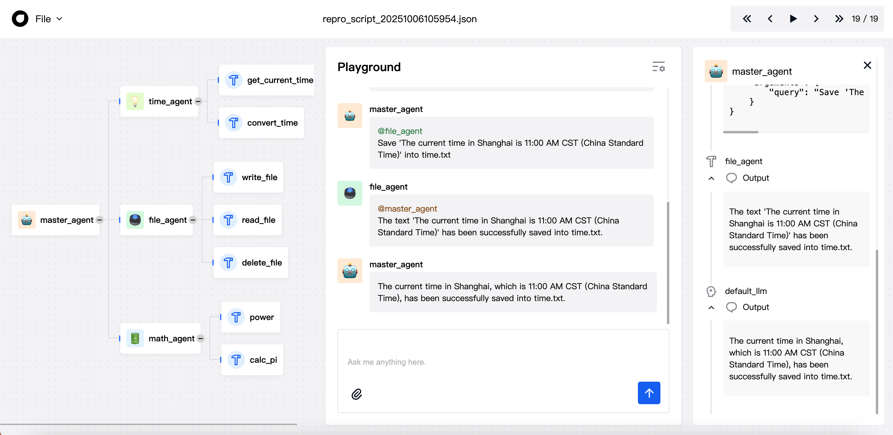
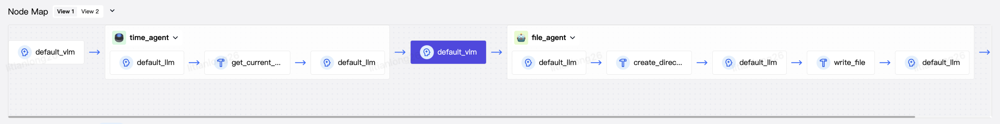

# 快速开始
Oxygent 是一个 Python 库，旨在简化使用 OpenAI 的 GPT 模型开发多智能体系统 (MAS) 的过程。它提供了一个简单的界面，用于创建智能体、管理智能体之间的交互以及处理矢量数据库和嵌入缓存等任务。

## 构建OxyGent运行环境

本指南演示如何使用 Oxygen 多智能体系统 (MAS) 框架设置环境并运行简单示例。以下步骤将指导您安装依赖项、配置环境以及执行示例脚本。

### Step 1：创建并激活 Python 环境

> ⚠️ 注意：OxyGent 仅支持 Python 3.10 及以上版本。  
> 请确保你的 Python 环境版本不低于 3.10，否则可能无法正常运

建议为您的项目使用专用的 Python 环境。您可以使用如下方式创建并激活环境：

#### conda
```bash
conda create -n oxy_env python==3.10
conda activate oxy_env
```
#### venv
```bash
python -m venv .venv
source .venv/bin/activate
```
#### uv
```bash
curl -LsSf https://astral.sh/uv/install.sh | sh
uv python install 3.10 
uv venv .venv --python 3.10
source .venv/bin/activate
```
### Step 2：安装所需的 Python 包

激活环境后，请使用以下命令安装所需的 Python 包：
```bash
pip install oxygent
```
如果使用uv，请使用如下命令：
```bash
uv pip install oxygent
```
### Step 3：编写示例 Python 脚本

以下是一个示例 Python 脚本 (demo.py)，演示了如何使用 Oxygen MAS 框架。此脚本初始化 MAS 实例并启动一个处理简单查询的 Web 服务。
```python
import os

from oxygent import MAS, Config, oxy
from oxygent import preset_tools

time_tools = preset_tools.time_tools
math_tools = preset_tools.math_tools
file_tools = preset_tools.file_tools

Config.set_agent_llm_model("default_llm")

oxy_space = [
    oxy.HttpLLM(
        name='default_llm',
        api_key=os.getenv('DEFAULT_LLM_API_KEY'),
        base_url=os.getenv('DEFAULT_LLM_BASE_URL'),
        model_name=os.getenv('DEFAULT_LLM_MODEL_NAME'),
        llm_params={
            'temperature': 0.01
        },
        semaphore=4
    ),
    time_tools,
    oxy.ReActAgent(
        name="time_agent",
        desc="A tool that can query the time",
        tools=["time_tools"],
    ),
    file_tools,
    oxy.ReActAgent(
        name="file_agent",
        desc="A tool that can operate the file system",
        tools=["file_tools"],
    ),
    math_tools,
    oxy.ReActAgent(
        name='math_agent',
        desc='A tool that can perform mathematical calculations.',
        tools=['math_tools'],
    ),
    oxy.ReActAgent(
        is_master=True,
        name="master_agent",
        sub_agents=["time_agent", "file_agent", "math_agent"],
    ),
]


async def main():


    async with MAS(oxy_space=oxy_space) as mas:
        await mas.start_web_service(first_query="What time is it now? Please save it into time.txt.")

if __name__ == "__main__":
    import asyncio

asyncio.run(main())
```

### Step 4：配置您的 LLM

在运行脚本之前，请设置以下环境变量来配置您的大型语言模型 (LLM) 服务：
```bash
export DEFAULT_LLM_API_KEY="your_api_key"
export DEFAULT_LLM_BASE_URL="your_base_url" # 如果您想使用自定义基础 URL
export DEFAULT_LLM_MODEL_NAME="your_model_name"
```
## 运行Oxygent 示例

> ⚠️ 注意：为了您的使用体验，建议您先安装好[Node.js](https://nodejs.org/)。

使用以下命令执行示例脚本：
```bash
python demo.py
```

查看输出：


你可以点击右侧`master_agent`下的文本查看动态生成调用流程图


## 下一步

:doc:/user_guide/index 了解如何使用Oxygent

:doc:/api/oxygent.mas 探索 API